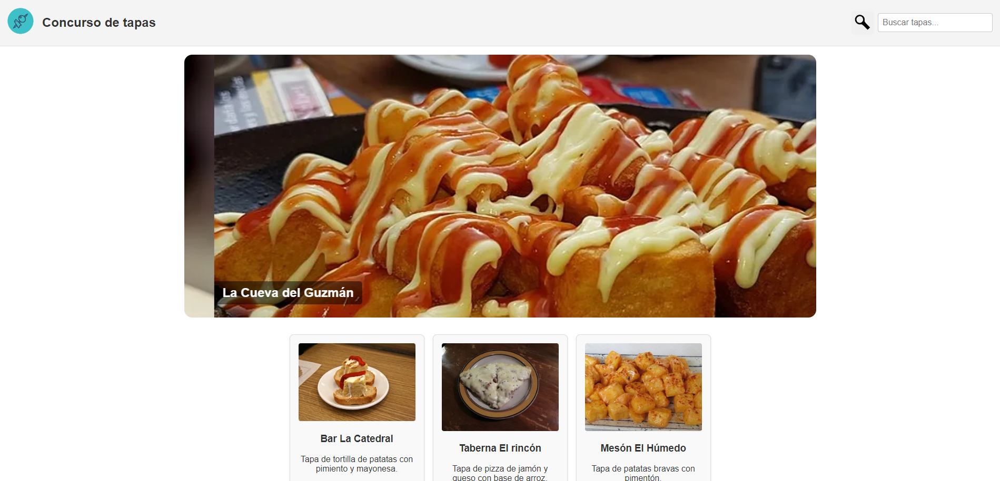

# Galería para el concurso de tapas

Página principal para un concurso de tapas. En esta página se encontrará un carrusel automático de imágenes y una galería de fotos con los nombres de los bares y una breve descripción de sus tapas.

La página cuenta con imágenes cuyo tamaño se adapta al tamaño de la ventana y un diseño responsivo.

### Redimensión de imágenes

En el repositorio se puede encontrar un archivo llamado optImagenes.js que convierte a webp y a distintos tamaños todas las imágenes (que no sean de tipo svg) de la carpeta _img_ y las pasa a la carpeta _imgOptim_. Esto se consigue utilizando los módulos _sharp_ y _fs_  de _Node_.

### Otros detalles

* Los logos de la página son imágenes vectoriales _svg_.
* Las imágenes de la página tienen el atributo `loading=lazy` para habilitar la carga perezosa.
* El carrusel de imágenes funciona totalmente con CSS, sin nada de JavaScript.

#### Realizado por los alumnos Isaac Alonso y Juan Álvaro Flórez.

